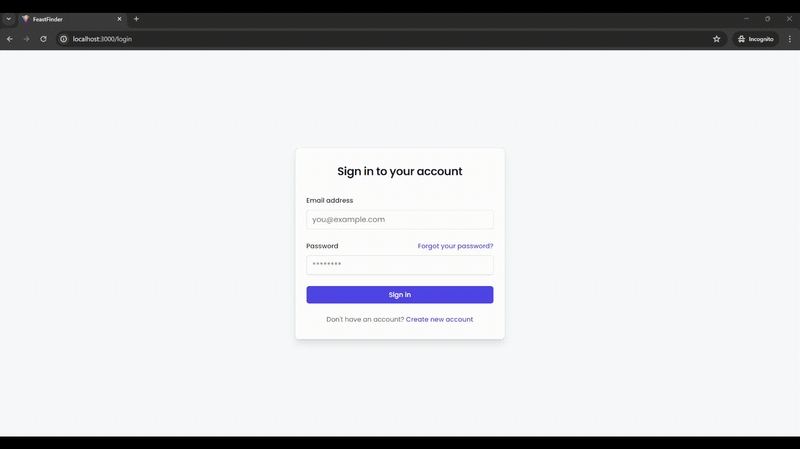

# FeastFinder


FeastFinder is an innovative recipe discovery and meal planning app designed to transform the culinary experience at home. Tailoring to personal dietary needs, from vegan to non-vegetarian, FeastFinder simplifies meal planning and helps discover new and exciting recipes.

## Table of Contents

- [About The Project](#about-the-project)
- [Features](#features)
- [Technologies Used](#technologies-used)
- [Leveraging Annoy for Enhanced Recipe Recommendations](#leveraging-annoy-for-enhanced-recipe-recommendations)
- [Getting Started](#getting-started)
  - [Prerequisites](#prerequisites)
  - [Installation](#installation)
    - [Local Installation](#local-installation)
      - [Backend Installation](#backend-installation)
      - [Frontend Installation](#frontend-installation)
    - [Docker Installation](#docker-installation)
      - [Running With Docker Compose](#running-with-docker-compose)
- [Working of the Application](#working-of-the-application)
- [Contributing](#contributing)
- [License](#license)
- [Contact](#contact)
- [Acknowledgements](#acknowledgements)

## About The Project

FeastFinder offers a seamless approach to meal planning, with features tailored for diverse dietary preferences. Focused on user convenience, recipes are smartly filtered by preparation and cooking times, matching personal taste, and accommodating specified allergies.

## Features

- **Dietary Customization**: Tailor your meal plans to fit dietary preferences like vegan, vegetarian, and non-vegetarian diets.
- **Cuisine Exploration**: Enjoy a rich variety of cuisines and discover recipes that bring global flavors to your kitchen.
- **Ingredient-Based Recommendations**: Get suggestions based on your frequently used ingredients and cooking habits.
- **Allergen Awareness**: Find recipes that are safe for your dietary restrictions and free from specified allergens.
- **Efficient Meal Planning**: Save time with recipes that fit your lifestyle, sorted by prep time, cook time, and total time.
- **Automated Weekly Meal Plans**: Let FeastFinder handle the planning with automated weekly meal suggestions.

## Technologies Used

  | Technology   | Version     |
  | ------------ | ----------- |
  | Node.js      | 18.2.0      |
  | Python       | 3.11        |
  | Flask        | 3.0.2       |
  | Annoy        | 1.17.3      |
  | React        | 18.2.0      |
  | React Router | 6.22.3      |
  | TailwindCSS  | 3.4.3       |
  | Vite         | 5.0.8       |
  | SQLAlchemy   | 2.0.29      |
  | numpy        | 1.26.4      |
  | pandas       | 2.2.1       |
  | scikit-learn | 1.4.1.post1 |

## Leveraging Annoy for Enhanced Recipe Recommendations

FeastFinder's recommendation engine is underpinned by Annoy (Approximate Nearest Neighbors Oh Yeah), a high-speed algorithm optimized for high-dimensional spaces. Developed by Spotify, Annoy facilitates swift, approximate nearest neighbor searches, enabling our app to provide real-time, personalized recipe recommendations.Annoy uses a collection of randomized trees to perform these searches. This method is particularly well-suited for large datasets, like our extensive recipe library, as it scales without sacrificing speed or accuracy. The algorithm ensures quick responses, vital for the interactive nature of FeastFinder, and allows our users to experience minimal delay when seeking meal inspiration.
Additionally, Annoy's compact in-memory footprint is ideal for mobile platforms, ensuring that FeastFinder remains responsive and efficient across devices. The open-source community continually refines Annoy, allowing FeastFinder to benefit from collective advancements in the field of machine learning.

To learn more about Annoy, explore the algorithm's capabilities, and understand why it's integral to FeastFinder's recommendation system, visit the [official Annoy GitHub page](https://github.com/spotify/annoy).

## Getting Started

These instructions will get you a copy of the project up and running on your local machine for development and testing purposes.

### Prerequisites

Before starting the installation, ensure you have the following installed on your system:

1. **Git**: Git is required to clone the repository. Install it from [git-scm.com](https://git-scm.com/downloads).
2. **Python** (for local installation): Install Python from [python.org](https://www.python.org/downloads/).
3. **Node.js** (for both installations): Install Node.js from [nodejs.org](https://nodejs.org/).
4. **Docker and Docker Compose** (for Docker installation): Follow the Docker installation instructions provided in the [Docker Installation section](#docker-installation).

### Installation

This section provides detailed instructions for setting up FeastFinder both locally and using Docker Compose.

#### Local Installation

Follow these steps to set up the application locally on your machine. This involves separate setups for the backend and frontend components.

**Note:** Make sure that there is nothing running on `PORT:5000` and `PORT:3000` while setting it up the application other wise it will cause error.

- [Backend Installation](#backend-installation)
  - [Windows](#windows)
  - [Linux / macOS](#linux-macos)
- [Frontend Installation](#frontend-installation)

  - [Windows](#windows-1)
  - [Linux/macOS](#linux/macOS-1)

- [Running the Application](#running-the-application)

  ### Clone the repository:

  ```bash
    git clone https://github.com/your_username/FeastFinder.git
    cd /FeastFinder
  ```

  ### Backend Installation

  #### Windows

  1. **Navigate to the backend directory**::

      ```bash
        cd /Matchmaking_system_backend
      ```

  2. **Set up a Python virtual environment**:

      ```cmd
        python -m venv venv .\venv\Scripts\activate
      ```

  3. **Install Python dependencies**:

      ```cmd
        pip install -r requirements.txt
      ```

  4. **Set environment variables**:
     The .env file typically resides in the root directory of your project where it can be easily accessed by your application during runtime. Here’s how you can set it up and use it:

     1. Create a `.env` File: In the root of your Flask project, create a new file named `.env`.
     1. Populate the `.env` File: Here’s an example of what you should include in a .`env` file for a Flask application:

        ```bash
          SECRET_KEY = your_very_secret_key_here
          DATABASE_URL = 'sqlite:///data/mydatabase.db'
        ```

  #### Linux / macOS

  1. **Navigate to the backend directory**:

        ```bash
        cd /Matchmaking_system_backend
        ```

  2. **Set up a Python virtual environment**:

      ```bash
        python3 -m venv venv source venv/bin/activate
      ```

  3. **Install Python dependencies**:

        ```bash
          pip install -r requirements.txt
        ```

  ### Frontend Installation

  #### Setting Up Environment Variables

  1. **Create a `.env` File**: In the root of your frontend directory (where your `package.json` file is located), create a new file named `.env`.

  2. **Configure API URL**:

  - Open the `.env` file and add the following line:

    ```plaintext
    VITE_BACKEND_BASE_API_URL=http://127.0.0.1:5000
    ```

  - This variable sets the base URL for your API requests to the backend. Adjust the URL if your backend server is running on a different address or port.

  #### Windows

  1. **Navigate to the frontend directory**:

      ```cmd
      cd /Matchmaking_system_backend
      ```

  2. **Install JavaScript dependencies**:

      ```cmd
        npm install
      ```

  #### Linux / macOS

  1. **Navigate to the frontend directory**:

      ```bash
        cd /Matchmaking_system_backend
      ```

  2. **Install JavaScript dependencies**:

        ```bash
          npm install
      ```

  ### Running the Application

  1. **Start the Flask backend**:

     ```bash
     cd /Matchmaking_system_backend
     flask run
     ```

  2. **In a new terminal, start the frontend**:

     ```bash
      npm start
     ```

  - **Accessing the App**: Open your web browser and visit `http://localhost:3000` to see the application running.

### Docker Installation

#### For Windows and Mac:

1. Download Docker Desktop from [Docker Hub](https://hub.docker.com/?overlay=onboarding).
2. Follow the installation guide to install Docker Desktop on your machine.

#### For Linux

Installation steps can vary by distribution, but here is a general guide for Ubuntu:

1. **Update Your Package Index**:

   ```bash
   sudo apt update
   ```

2. **Install Required Packages**:

   ```bash
   sudo apt install apt-transport-https ca-certificates curl software-properties-common
   ```

3. **Add Docker’s Official GPG Key**:

   ```bash
   curl -fsSL https://download.docker.com/linux/ubuntu/gpg | sudo apt-key add -
   ```

4. **Set Up the Stable Repository**:

   ```bash
   sudo add-apt-repository "deb [arch=amd64] https://download.docker.com/linux/ubuntu $(lsb_release -cs) stable"
   ```

5. **Install Docker CE (Community Edition)**:

   ```bash
   sudo apt update
   sudo apt install docker-ce
   ```

6. **Verify Installation**:
   ```bash
   sudo docker run hello-world
   ```

#### Installing Docker Compose

Docker Compose is a tool for defining and running multi-container Docker applications.

1. **Download Docker Compose** (adjust version number as necessary):

   ```bash
   sudo curl -L "https://github.com/docker/compose/releases/download/1.29.2/docker-compose-$(uname -s)-$(uname -m)" -o /usr/local/bin/docker-compose
   ```

2. **Apply Executable Permissions**:

   ```bash
   sudo chmod +x /usr/local/bin/docker-compose
   ```

3. **Verify Installation**:
   ```bash
   docker-compose --version
   ```

#### Running the Application

Using Docker Compose, you can easily build and start the services defined in your docker-compose.yml file.

1. **Build and Run Docker Containers**

```sh
docker-compose up --build
```

- This command will start all services specified in `docker-compose.yml`. Use the `-d` flag to run in detached mode.

- **Note:** This may take a while to setup make sure that your device does not goes to sleep while it is setting up.

2. **Accessing the Application**

   - Once setup is complete, you can open your web browser and navigate to `http://localhost:3000` to view the app.

## Working of the Application

#### **Search Recipes by ingredients** : Explore recipes by typing in the ingredients you have on hand to find the perfect match for your next meal.


#### **Search Recipes by name** : Refine your recipe search using filters to find dishes that fit your dietary preferences and cooking time constraints.


#### Log in to access your personalized recipe recommendations and curated meal plans.



#### Sign up for a new account with ease and start your journey to culinary mastery.


#### Effortlessly reset your password with our secure and straightforward password recovery process.


##### Get a personalized onboarding experience that sets you up for a culinary adventure tailored to your preferences.


#### Dive into our extensive category list to discover recipes that cater to every cuisine, occasion, and taste.


#### Customize your user preferences to tailor your recipe discovery experience to your taste and dietary needs.


####

## Troubleshooting

- **Dependency issues**: Ensure all dependencies are correctly installed, and the virtual environment is activated when running Flask.
- **Check if `PORT` are in used**: Make sure that there is nothing running on `PORT:5000` and `PORT:3000` while setting it up the application other wise it will cause error.
- **Environment Variables**: Confirm that all required environment variables are set in `.env` or your OS.

## Reference

- The dataset used in this application is from [here](https://www.kaggle.com/datasets/irkaal/foodcom-recipes-and-reviews).
- The Annoy model used int this application docs can be viewed [here](https://github.com/spotify/annoy)
